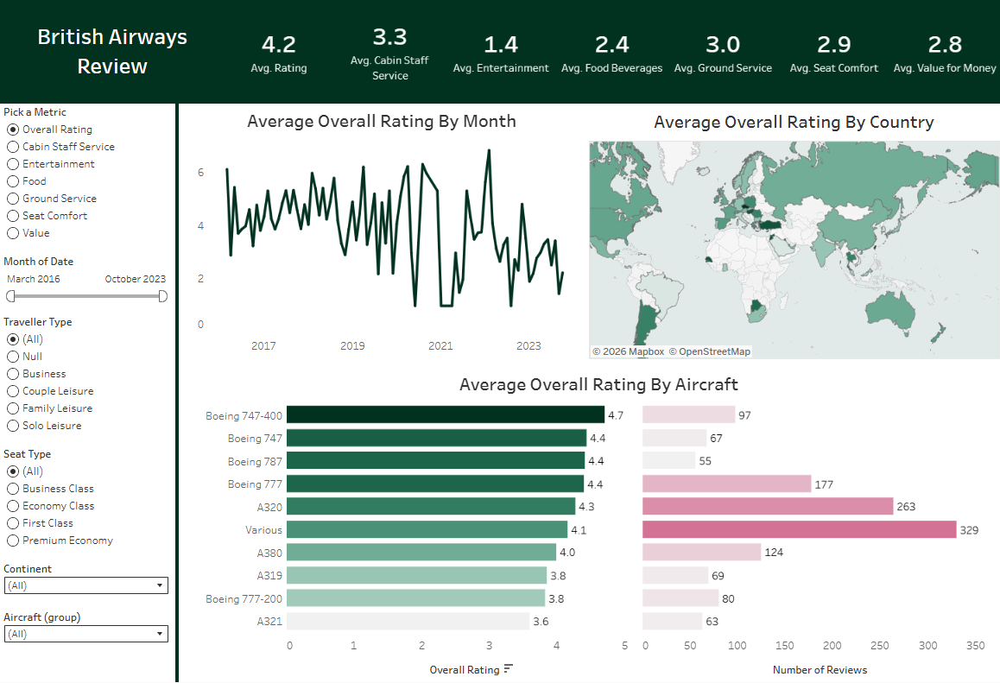

# British Airways Customer Reviews Analysis

## Executive Summary
This project demonstrates end-to-end data analysis of airline customer feedback, from raw review data to actionable business decisions. Were analyzed British Airways passenger reviews enriched with geographic attributes and service metrics. 
Using Tableau, I built an interactive dashboard to evaluate satisfaction drivers across aircraft, seat class, traveler type, region, and time. The analysis identifies key experience gaps and quantifies how different service dimensions influence overall ratings.

Key findings show that cabin staff service is the strongest contributor to satisfaction, while entertainment and value for money underperform across segments. Ratings also vary by aircraft and geography, highlighting operational inconsistency.

👉  [Tableau Public Dashboard](https://public.tableau.com/app/profile/anastasia.tsyktor/viz/BritishAirwaysDashboard_17720308463710/Dashboard1)

The dashboard enables to monitor customer experience KPIs and segment performance without working with raw data.

## Business Problem

Airlines operate in a highly competitive environment where customer experience directly impacts loyalty, brand perception, and revenue. British Airways receives thousands of online reviews annually, but unstructured feedback is difficult to analyze at scale.

### Key analytical questions:
- Which service dimensions drive overall passenger satisfaction?
- How does satisfaction vary by aircraft, seat class, and region?
- Are there temporal trends or service instability over time?
- Where should the airline prioritize experience improvements?

## Skills Demonstrated
- Data preparation and transformation
- Exploratory and statistical analysis
- Data visualization (Tableau)
- Business analytics

## Results 
- Cabin staff service is the highest-rated dimension and closely aligned with overall rating.
- Entertainment and value for money are consistently the lowest-rated categories.
- Satisfaction varies significantly by aircraft group.
- Regional differences indicate operational inconsistencies.
- Business class shows higher but more polarized ratings.
- Monthly averages reveal service instability over time.

### Business Recommendations

1. Modernize in-flight entertainment
 Low ratings indicate outdated systems and limited content.
2. Improve value perception
 Mismatch between ticket price and experience reduces satisfaction.
3. Standardize service across aircraft
 Variability suggests product or crew consistency issues.
4. Investigate low-performing regions
 Route-level differences likely affect experience quality.
5. Monitor KPIs continuously
 Use review data as an ongoing service performance signal.

